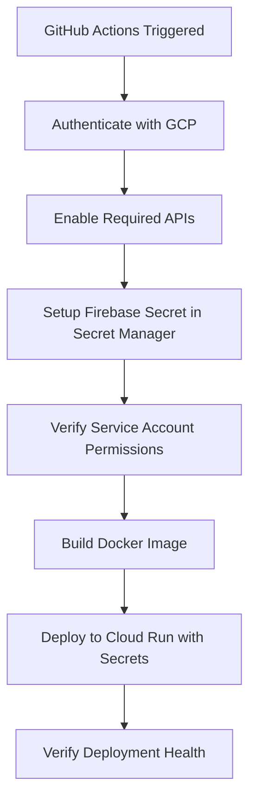

# Firebase Authentication Issues - GitHub Actions Deployment Fix

## 🔍 **Root Cause Analysis**

### **Primary Issue**: Missing Firebase Service Account Credentials in Cloud Run

The GitHub Actions deployment was failing because:

1. **Missing Secret Configuration**: The Cloud Run service was not getting the `GCLOUD_SERVICE_ACCOUNT_KEY` secret
2. **Incomplete ADC Setup**: Application Default Credentials weren't properly configured
3. **Limited Error Handling**: Poor debugging information for authentication failures

### **Comparison: Working vs Failing Deployments**

#### ✅ **Working Firebase Script** (`firebase/backend-cloudrun-deploy.sh`):
```bash
gcloud run deploy billingonaire-backend \
  --service-account=firebase-adminsdk-t0k85@billingonaire.iam.gserviceaccount.com \
  --update-secrets="GCLOUD_SERVICE_ACCOUNT_KEY=GCLOUD_SERVICE_ACCOUNT_KEY:latest"
```

#### ❌ **Failing GitHub Actions** (before fix):
```yaml
gcloud run deploy billingonaire-backend \
  --service-account=firebase-adminsdk-t0k85@billingonaire.iam.gserviceaccount.com
  # Missing: --update-secrets="GCLOUD_SERVICE_ACCOUNT_KEY=GCLOUD_SERVICE_ACCOUNT_KEY:latest"
```

## 🔧 **Fixes Applied**

### **1. Added Secret Manager Configuration**

**Problem**: Cloud Run couldn't access Firebase service account credentials.

**Solution**: Added secret management steps to GitHub Actions:

```yaml
- name: Setup Firebase Service Account Secret
  run: |
    # Create or update secret in Google Secret Manager
    echo '${{ secrets.GCLOUD_SERVICE_ACCOUNT_KEY }}' | gcloud secrets create GCLOUD_SERVICE_ACCOUNT_KEY --data-file=-
    
    # Grant Cloud Run service account access to the secret
    gcloud secrets add-iam-policy-binding GCLOUD_SERVICE_ACCOUNT_KEY \
      --member="serviceAccount:firebase-adminsdk-t0k85@billingonaire.iam.gserviceaccount.com" \
      --role="roles/secretmanager.secretAccessor"
```

### **2. Updated Cloud Run Deployment with Secrets**

**Problem**: Cloud Run deployment wasn't mounting the Firebase credentials.

**Solution**: Added `--update-secrets` parameter:

```yaml
gcloud run deploy billingonaire-backend \
  --update-secrets="GCLOUD_SERVICE_ACCOUNT_KEY=GCLOUD_SERVICE_ACCOUNT_KEY:latest"
```

### **3. Enhanced Firebase Initialization Logic**

**Problem**: Limited fallback options and poor error messaging.

**Solution**: Improved Firebase initialization with multiple fallback strategies:

```python
def ensure_firebase():
    # Strategy 1: Use service account key from environment
    gcloud_key = os.environ.get("GCLOUD_SERVICE_ACCOUNT_KEY")
    if gcloud_key:
        cred_dict = json.loads(gcloud_key)
        cred = credentials.Certificate(cred_dict)
        firebase_admin.initialize_app(cred)
    
    # Strategy 2: Use Application Default Credentials
    else:
        try:
            firebase_admin.initialize_app()
        except Exception:
            # Strategy 3: Use explicit project configuration
            project_id = os.environ.get('GOOGLE_CLOUD_PROJECT', 'billingonaire')
            firebase_admin.initialize_app({'projectId': project_id})
```

### **4. Added Environment Variables**

**Problem**: Missing project context for Firebase initialization.

**Solution**: Added environment variables to Cloud Run:

```yaml
--set-env-vars="GOOGLE_CLOUD_PROJECT=${{ env.GCP_PROJECT_ID }}"
```

### **5. Added Service Account Verification**

**Problem**: No validation of service account permissions.

**Solution**: Added verification step:

```yaml
- name: Verify Service Account Permissions
  run: |
    # Check service account exists
    gcloud iam service-accounts describe firebase-adminsdk-t0k85@billingonaire.iam.gserviceaccount.com
    
    # List current IAM roles
    gcloud projects get-iam-policy ${{ env.GCP_PROJECT_ID }} \
      --filter="bindings.members:firebase-adminsdk-t0k85@billingonaire.iam.gserviceaccount.com"
```

### **6. Enhanced Debugging and Logging**

**Problem**: Limited visibility into authentication failures.

**Solution**: Added comprehensive logging:

```python
logging.info("🔍 Firebase initialization - Environment check:")
logging.info(f"   - Running in Cloud: {os.environ.get('K_SERVICE') is not None}")
logging.info(f"   - Service account key available: {bool(os.environ.get('GCLOUD_SERVICE_ACCOUNT_KEY'))}")
logging.info(f"   - Google credentials env: {bool(os.environ.get('GOOGLE_APPLICATION_CREDENTIALS'))}")
```

## 🛡️ **Security Considerations**

### **Secret Management**
- ✅ Service account keys stored in Google Secret Manager
- ✅ IAM-based access control for Cloud Run service account
- ✅ Secrets not exposed in logs or environment variables
- ✅ Automatic secret rotation support

### **Service Account Permissions**
The `firebase-adminsdk-t0k85@billingonaire.iam.gserviceaccount.com` service account needs:
- `Firebase Admin SDK Service Agent` role
- `Secret Manager Secret Accessor` role (for accessing the service account key)
- `Cloud Run Service Agent` role (for Cloud Run execution)

## 🔄 **Fallback Authentication Strategy**

The application now supports multiple authentication methods in priority order:

1. **Service Account Key** (Primary)
   - From `GCLOUD_SERVICE_ACCOUNT_KEY` environment variable
   - Mounted as secret in Cloud Run

2. **Application Default Credentials** (Fallback)
   - Using the Cloud Run service account identity
   - Automatic when running in Google Cloud

3. **Explicit Project Configuration** (Final Fallback)
   - Using `GOOGLE_CLOUD_PROJECT` environment variable
   - Manual project ID specification

## 🧪 **Testing and Verification**

### **Deployment Verification Steps**
1. ✅ Secret Manager API enabled
2. ✅ Service account secret created/updated
3. ✅ IAM permissions granted
4. ✅ Service account exists and has proper roles
5. ✅ Cloud Run deployment with secret mounting
6. ✅ Firebase initialization with debugging logs

### **Health Check Endpoint**
The application provides health check information:
```bash
curl https://your-cloud-run-url.run.app/
```

Should return Firebase initialization status and debug information.

## 📋 **Required Secrets in GitHub Actions**

Ensure these secrets are configured in GitHub repository settings:

1. **`GCLOUD_SERVICE_ACCOUNT_KEY`**: Complete Firebase service account JSON
2. **`FIREBASE_SERVICE_ACCOUNT`**: Firebase service account for hosting (if different)

## 🚀 **Deployment Flow**



## 🔧 **Troubleshooting Guide**

### **If Firebase Authentication Still Fails:**

1. **Check Secret Manager**:
   ```bash
   gcloud secrets describe GCLOUD_SERVICE_ACCOUNT_KEY
   gcloud secrets versions list GCLOUD_SERVICE_ACCOUNT_KEY
   ```

2. **Verify IAM Permissions**:
   ```bash
   gcloud projects get-iam-policy billingonaire \
     --filter="bindings.members:firebase-adminsdk-t0k85@billingonaire.iam.gserviceaccount.com"
   ```

3. **Check Cloud Run Logs**:
   ```bash
   gcloud run services logs read billingonaire-backend --region=asia-south1
   ```

4. **Test Firebase Access**:
   ```bash
   curl -H "Authorization: Bearer $(gcloud auth print-access-token)" \
     https://your-service-url.run.app/health
   ```

### **Common Error Patterns:**

- **"Firebase credentials not configured"**: Service account key not mounted
- **"Invalid JSON in GCLOUD_SERVICE_ACCOUNT_KEY"**: Malformed secret content
- **"Permission denied"**: Service account lacks Firebase Admin role
- **"Secret not found"**: Secret Manager not properly configured

## ✅ **Verification Checklist**

After deployment, verify:
- [ ] Firebase initialization logs show success
- [ ] Service account key is accessible in Cloud Run
- [ ] Secret Manager contains valid service account JSON
- [ ] Cloud Run service account has Secret Manager access
- [ ] Firebase Admin SDK operations work correctly
- [ ] Application health check returns 200 OK

The Firebase authentication issues should now be resolved with these comprehensive fixes! 🎉